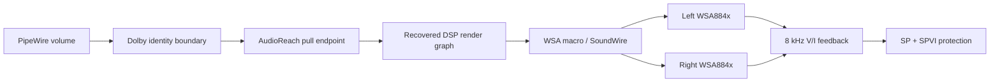

# Surface Pro 11 (X1E) audio for Linux

Evidence-driven Linux audio bring-up for the Microsoft Surface Pro 11 with the
Qualcomm X1E80100 AudioReach, SoundWire and dual WSA884x stack.

This project reconstructs the machine's Windows speaker pipeline from captured
transactions, its REV_0D ACDB, the shipped ARM64 Qualcomm drivers and controlled
Linux tests. Kernel/DT, DSP topology, ALSA UCM and PipeWire policy are kept as
separate layers so that an acoustic result is never mistaken for a driver fact.

> **Project state (2026-08-02):** the protected, non-Dolby playback baseline is
> booted and accepted. Dolby remains present only as an identity/bypass boundary.
> This is research-quality hardware enablement, not an upstream-ready driver or
> a general-purpose installation package.

> **Dolby completion branch update (2026-08-05):** on
> `agent/dolby-completion-2026-08-05`, the original Windows ARM64
> `DolbyAPOvlldp150 -> DolbyApoVr` processing path is executing on Linux as an
> experimental overlay above the accepted protected lower graph. Final Windows
> parity is **not** yet certified. Start with
> [`docs/audit/2026-08-05-CANONICAL-DOLBY-PIPELINE.md`](docs/audit/2026-08-05-CANONICAL-DOLBY-PIPELINE.md),
> not the older Dolby state-of-play notes.

## Current baseline

The accepted control is kernel `7.1.5-sp11-audio-clean+`, GRUB ID
`sp11-audio-clean`, built after `mrproper` from source commit
`f102e3fa8c7e860f3a9ac3ba2043a5fd55242e44`.

| Area | Accepted state |
|---|---|
| Render | 48 kHz, S16_LE, stereo AudioReach pull endpoint |
| Protection feedback | Both WSA884x VISENSE paths, 8 kHz/S32_LE/stereo |
| Speaker protection | SP/SPVI setup in captured Windows order; graph starts |
| Amplifier operating point | PA 24 (+27 dB), WSA digital 81 (-3 dB), both channels |
| PA_AUX | Normal variant-selected 0 dB (`0xdd`), not the retired 18 dB experiment |
| Dolby | `sp11_dolby_bypass`; no Dolby coefficients or dynamic processing |
| Operator result | Both speakers, usable ceiling, no dropout in the accepted control windows |

The baseline has the complete Ubuntu module catalogue and the required Phase91
Wi-Fi, touch, GPI and SPI overrides. Exact installed hashes and the acceptance
record are in [`deploy/audio-clean/README.md`](deploy/audio-clean/README.md).



The diagram shows functional flow, not a claim that every Windows policy branch
has already been reproduced.

## What is proven

- The Windows-compatible pull transport, OOB mapping, graph lifecycle replies
  and repeated-prepare behavior work under normal desktop playback.
- The reconstructed render graph has 29 recovered modules, 26 data edges,
  three internal control links and seven containers.
- Both amplifier V/I sources reach the render-coupled feedback backend.
- The captured SP/SPVI setup and graph start complete repeatedly.
- The upstream machine-driver PA-volume ceiling was the principal Linux
  loudness restriction. The accepted baseline removes that temporary ceiling
  only while the protected graph and VI path are present.
- Runtime DSP volume control and a narrowly allowlisted MSIIR parameter
  transport are proven. This transport is a prerequisite for later Dolby work;
  it is not Dolby processing by itself.
- Windows requests the full selected 10,464-byte/107-frame graph calibration.
  Qualcomm GSL treats status `3` from that calibration boundary as a warning
  and continues. Linux now follows that narrowly scoped policy.

The calibration conclusion is bound to the captured transaction, the recovered
ACDB and fresh decompilation of the hash-matched Windows `qcadcm8380.sys`; see
[`2026-08-02-windows-graph-calibration-warning-policy.md`](docs/findings/2026-08-02-windows-graph-calibration-warning-policy.md).

## Accepted and rejected candidates

| Candidate | Decision | Reason |
|---|---|---|
| `audio-clean` | **Accepted control** | Both speakers and stable restarts with the full Windows-selected calibration |
| `audio-clean2` | Rejected | Removed one 48-byte calibration frame contrary to Windows; reproduced right-only physical audio |
| `audio-mapdiag` | Rejected as a baseline | Inherited Clean2 and added invasive amplifier diagnostics; developed long starts and a channel failure |

Reading the full WSA884x debugfs register files is not passive: it populates the
regmap cache, which can later be replayed after a SoundWire detach. Even piping
that generated file through a filter still reads the entire map. The normal
collector therefore performs no WSA884x debugfs register walk; a full dump is
explicit opt-in only.

## What remains open

The accepted baseline is not yet a claim of one-to-one Windows parity. Before
closing the non-Dolby phase, the remaining evidence work is:

1. Resolve Windows' separate amplifier-reset lifecycle against Linux's stable
   shared-reset arrangement.
2. Decode post-start protection telemetry, including TMax/XMax readback, and
   observe protection acting rather than only accepting configuration.
3. Determine whether Windows actively uses the CPS hardware sidechain on this
   exact machine.
4. Establish whether any genuine per-speaker calibration or hardware
   asymmetry exists. Device-tree left/right labels alone are not proof of the
   physical mapping.

Dolby/Surface APO behavior, coefficient recovery and transition handling are a
separate next phase. No equalizer or guessed dynamics should be added to the
baseline to imitate them.

## Evidence policy

The recovered corpus contains strong evidence, incomplete fragments and prior
AI-generated analysis. This repository follows these rules:

- Bind claims to hashes, addresses, captures or reproducible live observations.
- Prefer the shipped Windows binaries and dynamic QGPR/KD captures over prose
  produced in earlier sessions.
- Record hypotheses as hypotheses and preserve corrected conclusions.
- Keep raw vendor firmware, ACDB and dumps untracked unless redistribution
  rights are known.
- Never overwrite a working kernel, DTB, topology or UCM installation; every
  candidate gets a separate rollback-safe boot entry.
- Do not treat a successful PCM open or graph start as proof that speaker
  protection is actively limiting the hardware.

## Repository map

| Path | Purpose |
|---|---|
| [`deploy/audio-clean/`](deploy/audio-clean/) | Accepted boot identity, hashes and Phase91 boot assets |
| [`deploy/ucm2/`](deploy/ucm2/) | SP11 ALSA UCM policy |
| [`deploy/pipewire/98-sp11-dolby-bypass.conf`](deploy/pipewire/98-sp11-dolby-bypass.conf) | Identity boundary reserved for Dolby work |
| [`patches/`](patches/) | Ordered Linux changes and their status |
| [`docs/audit/`](docs/audit/) | Windows/Linux transaction and provenance audits |
| [`docs/findings/`](docs/findings/) | Evidence-backed technical findings and corrections |
| [`docs/deployment/`](docs/deployment/) | Candidate identities, validation gates and outcomes |
| [`artifacts/reviewed/`](artifacts/reviewed/) | Small reviewed records safe to version |
| [`tools/`](tools/) | Capture, topology, ACDB and QGPR analysis utilities |

The accepted decision is documented in
[`2026-08-01-audio-clean-baseline.md`](docs/deployment/2026-08-01-audio-clean-baseline.md).
The Windows/Linux start sequence is in
[`2026-07-28-windows-linux-start-transaction-ledger.md`](docs/audit/2026-07-28-windows-linux-start-transaction-ledger.md).

## Reproducing the tracked analysis

Lint and inventory a decoded or binary AudioReach topology:

```sh
./tools/ar_topology_lint.py topology.bin
./tools/ar_topology_inventory.py topology.bin --json inventory.json --markdown inventory.md
```

Decode Windows ACDB graph objects and their selector/connection metadata:

```sh
./tools/ar_graph_open_inventory.py 01e842_POOL.bin --offset 0x35d84
./tools/acdb_gkv_inventory.py GKVT.bin GKVL.bin --pool 01e842_POOL.bin --json windows-gkv.json
./tools/acdb_sclu_inventory.py 00ea12_SCLU.bin \
  --scde 00f4be_SCDE.bin --scdo 00f4f2_SCDO.bin \
  --pool 01e842_POOL.bin --json windows-sclu.json
```

Reconstruct the typed graph closure and decode the captured activation lists:

```sh
./tools/windows_graph_closure.py windows-bundle.json windows-sclu.json \
  --json windows-closure.json
./tools/qgpr_activation_inventory.py qgpr.decoded.csv windows-gkv.json \
  --json activations.json
```

The repository intentionally does not offer a blind one-command installer for
unknown machines. Deployment is tied to the exact SP11 hardware, hashes and
rollback procedure recorded under `deploy/` and `docs/deployment/`.

## Scope boundary

The archived PipeWire EQ is disabled and is not part of parity work. The Dolby
identity boundary must remain bit-transparent until the vendor processing is
understood well enough to implement and test it without hiding defects in the
kernel, topology or protection path.
