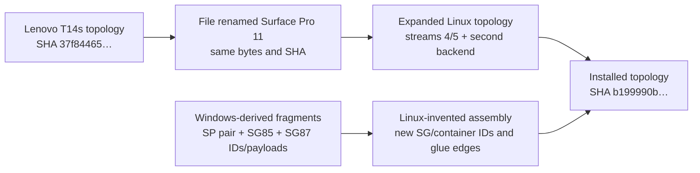
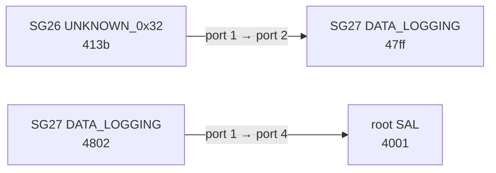
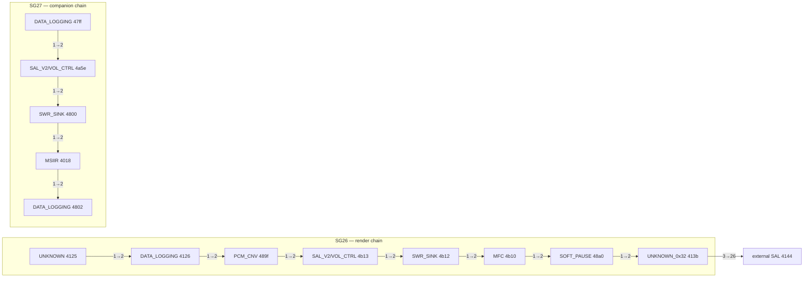
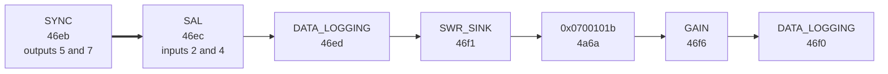
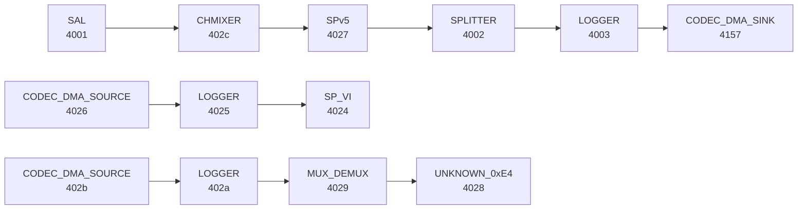

# SP11 audio pipeline provenance audit — pass 1

Date: 2026-07-22

## Scope and stop rule

This pass audits construction, module identity, containers, connections, and
provenance. EQ coefficients, subjective tuning, Dolby emulation, loudness
calibration, and deployment are deliberately out of scope until the structural
ledger is closed.

The current topology is not a faithful transcription of one Windows graph. It
is a Lenovo donor topology expanded with several Windows-derived fragments and
Linux-invented glue. Some fragments are internally accurate, but their assembly
is not.

## Evidence grades

| Grade | Meaning |
|---|---|
| A | Decoded directly from a raw machine observation, or byte-for-byte verified from an installed artifact |
| B | Decoded directly from raw Windows ACDB chunks; proves a Windows configuration body exists, not that Windows selected it in the captured session |
| C | Real Windows runtime boundary evidence, but the out-of-band command body is absent |
| D | Historical report or interpretation awaiting reproduction |

No historical narrative is promoted above grade D merely because it calls
itself canonical, verified, or solved.

## Primary source inventory

| Source | SHA-256 / identity | Grade | Use |
|---|---|:---:|---|
| Installed Linux topology | `b199990b65d7f07b8dca6e69e3ecad7706c998b510720520aec6dbbf7d9b5a2d` | A | Active Linux module and DAPM graph |
| Original file named Surface topology | `37f84465d843043a0ffb8c33423b1d350669c5688306328056e334d0c67a20f8` | A | Starting artifact |
| Lenovo T14s topology | `37f84465d843043a0ffb8c33423b1d350669c5688306328056e334d0c67a20f8` | A | Proves the original Surface file was a literal rename |
| Windows `SGIT` | `e7bf6eeaf5f2a0f2b18093b8ce30fbc788305447aa3fd0ab932b0444a0afa4a9` | B | Subgraph module membership |
| Windows `SCLU` | `b9849331d767591bde479f00f1826d6904e68832ba1c58e7ecc31d041c3a0190` | B | Cross-subgraph lookup keys and SCDO offsets |
| Windows `SCDO` | `46de7cd4654e3ce6da69daf62229e128fb5f84f21dec6e1032480253817c3431` | B | Resolves SCLU records to one or more POOL objects |
| Windows `POOL` | `35073b935392fa6981f514d14871b003442e47d8a96b24a34b845e1b3f0ae759` | B | Containers, module lists, port declarations, and directed edges |
| Windows `GKVT` | `7178285fc655efd7b8b521b5c7f1338ce5a7e58cfda5f314835e9c77c7707800` | B | GKV schema and value-table offsets |
| Windows `GKVL` | `824497e10881b2d33d0787c3864bf50d241ec951484ef766ee439e843dd51af4` | B | GKV rows, auxiliary offsets, and `POOL` bundle offsets |
| QGPR boot-init decoded capture | `85379015c2e7795c0ca5597f7d1a6162cc2c521f89d9b210e3acec545f9f2ee9` | C | Live command order and OOB body sizes, not graph body contents |
| QGPR extended decoded capture | `3a2b03868033cff3a147e4e120f05809b957da276217d963e457683b1fae2ca0` | C | Live post-toggle activation lists, command order, and OOB sizes |
| Raw KDNET boot log | `ab06b706109f4fb86fb6176daf3ccf004852ab64b868e11de8a005e16ba8880c` | C | Live `qcadcm` GRAPH_OPEN wrapper and ACDB selector boundary |
| Raw KDNET playback log | `e5eaeabfece9ec8b4fb44d5b98ed4dcb62ebca6302545bfd2a84c038ea13a872` | C | Additional live GRAPH_OPEN wrapper observations |
| Windows `qcadcm8380.sys` | `37f76305ac8051b0b03b6d2ce1df7a353253debf546e512e447c9d95ec661429` | A | ARM64 control flow and exact live-capture offsets |
| Instrumented Linux graph-open log | `9959718ced3ee5a3a0e6dce2b9f89b9149e04ab9f32d0d89d85e7fb0938770a2` | A | Exact graph 105 serialization, dynamic link, packet size, and DSP response |
| WSA884x codec source with local skip | `9e2d96f67e0daf9a914580a640120b89d1456a6ca316c6148d1cf1247a97fb6f` | A | Codec port directions, masks, controls, and current workaround |
| Qualcomm SoundWire master source | `6dea347565244472ff25c641672ac30c13cb47258cd7f272ada2b6b5b9f754d9` | A | Slave-to-master port allocation behavior |
| SP11 source DT | `f289b854e3687b04279629f3eef18f9d8d3778c76b19fa67d3f462f4fbef521a` | A | WSA8845 slave-to-master port mapping |
| Historical Linux audio dmesg | `2663f64129760a8325e1cec483fe1c63519790314153fe02851eeaf0d25302c9` | A | Raw controller attribution for the earlier bus-clash incident |
| Installed UCM `SP11-HiFi.conf` | `77cd64d7dc8d59638932e5f33f1d424d4ff7f984321972330ea7456bd90a01c3` | A | Current route/control policy |
| `no-extra-msiir` comparison topology | `36adf284bdb3ad9477bf85e6d4ddd6f5316a9316b1f115e0a04739b758ca14f8` | A | Structural comparison only; not approved for deployment |

The raw Windows graph bodies below were decoded independently from `POOL`.
The decoder now distinguishes individual subgraph records from the size-prefixed
multi-subgraph bundles referenced by `GKVL`; this is important because treating
a bundle as one record silently exposes only its first subgraph.

## Construction lineage

The active file contains 91 widgets and 87 AudioReach modules. Eighteen modules
are encoded as raw byte arrays that the ordinary `alsatplg` text view does not
render as normal vendor tuples. Any inventory that reports only 69 modules has
missed those injected modules.

## Windows ACDB graph facts

### GKV lookup binding

`GKVT` and `GKVL` are now decoded structurally rather than inferred from prior
reports. `GKVT` supplies schemas composed of raw key IDs and offsets into
`GKVL`. Each `GKVL` row supplies the values for that schema, an auxiliary
offset, and a `POOL` offset. At that `POOL` offset is a size-prefixed bundle of
one or more complete subgraph records.

Exactly one six-key row points to a bundle containing subgraph `0xb0000086`:

| Raw key IDs | Raw values | Aux | `POOL` | Bundle subgraphs |
|---|---|---:|---:|---|
| `01000001` … `01000006` | `[1, 3, 1, 1, 3, 3]` | `0x5ac` | `0x358d0` | `0xb000002a`, `0xb0000086`, `0xb0000087` |

The bundle is `0x860` bytes, contains 21 modules and 22 connections, and hashes
to `2569c85a71d187c588c4ff6fc71bb306c670cc71b78160e21def7de8ef436443`.
The raw key IDs are deliberately left uninterpreted until their semantic names
are recovered from an authoritative source.

Nearby rows demonstrate that these are separate selected graph families, not
a menu of fragments intended to be loaded together:

| Raw values | `POOL` | Bundle subgraphs |
|---|---:|---|
| `[1, 3, 1, 1, 3, 1]` | `0x34d14` | `0xb0000001`, `0xb0000077`, `0xb0000078` |
| `[1, 3, 2, 1, 3, 1]` | `0x36e28` | `0xb0000001`, `0xb0000078`, `0xb0000079` |
| `[1, 4, 1, 1, 4, 3]` | `0x39af8` | `0xb000002a`, `0xb0000084`, `0xb0000085` |

This proves the static lookup association for the SG86/SG87 render family. It
does **not** yet prove that Windows selected raw values `[1, 3, 1, 1, 3, 3]`
during the user's captured playback session.

### Runtime activation lists recovered from QGPR

The in-band GRAPH_START packets in the saved QGPR capture contain a count and
three explicit subgraph IDs. Earlier reports noticed only the root marker and
missed the other two IDs, although all three bytes were present in the raw
packet column. Each observed triple is unique among the decoded GKV rows, so
the runtime activation can be bound to an exact static bundle without guessing
from the GRAPH_OPEN size:

`tools/qgpr_activation_inventory.py` performs the pairing and GKV resolution
directly from the decoded QGPR CSV and the generated GKV inventory.

| QGPR sequence | Port | GRAPH_OPEN size | GRAPH_START subgraphs | Raw GKV values | `POOL` |
|---:|---:|---:|---|---|---:|
| 3 | `0x2010` | `0xb18` | `01`, `7f`, `7e` | `[2, 2, 1, 2, 2, 1]` | `0x3d164` |
| 52 | `0x2010` | `0xb18` | `01`, `83`, `82` | `[2, 7, 1, 2, 7, 1]` | `0x42668` |
| 101 | `0x2010` | `0x5d8` | `44`, `40`, `41` | `[3, 1, 1, 3, 1, 16]` on raw keys `08`–`0d` | `0x26694` |
| 5717 | `0x2011` | `0xb18` | `01`, `7f`, `7e` | `[2, 2, 1, 2, 2, 1]` | `0x3d164` |
| 9727, 9777 | `0x2010` | `0xa40` | `01`, `27`, `26` | `[3, 1, 1, 3, 1, 1]` | `0x439a8` |
| 10365 | `0x2010` | `0xb18` | `01`, `7f`, `7e` | `[2, 2, 1, 2, 2, 1]` | `0x3d164` |

The first three rows are already present in the shorter boot-before-music
capture. The later rows occur in the extended capture after the music toggle
and volume activity. A `0xb18` open at sequence 10321 was configured and then
flushed without a GRAPH_START; sequence 10365 is the succeeding started open.

Most importantly, no saved GRAPH_START activates SG85, SG86, or SG87. The two
`0xa40` opens in the recorded music window activate the 26-module
`root+SG27+SG26` bundle. SG27 contains a real Windows MSIIR (`IID 0x4018`),
while SG26 contains the complementary data-logging, conversion, pause, MFC,
SWR, volume-control, and terminal `0x32` chain. This is session-specific proof,
not a claim that every Windows endpoint mode selects the same family.

### SCLU cross-subgraph bridge layer

The raw Windows `00ea12_SCLU.bin` is a count-prefixed table of 170 fixed-size
records. Each record contains a source subgraph ID, a destination subgraph ID,
and two additional 32-bit words. The fourth word is now verified as an offset
into `SCDO`: the referenced SCDO item supplies a count and one or more POOL
offsets. Compact POOL objects then decode as a connection count followed by
`source IID, source port, destination IID, destination port`. The third SCLU
word remains `raw_word_2`; its complete semantics are not established and it
is not simply the POOL object's payload size.

`tools/acdb_sclu_inventory.py` performs this SCLU → SCDO → POOL resolution
directly and preserves raw words for non-compact object forms.

The raw lookup chain supplies both the subgraph ordering and exact module-port
bridges for every three-subgraph set seen in the saved GRAPH_START packets:

| Runtime set | Exact SCLU relationships | Resolved module-port bridges | Record indexes |
|---|---|---|---|
| `01`, `27`, `26` | `26 → 27 → 01` | `413b:1 → 47ff:2`; `4802:1 → 4001:4` | 45, 46 |
| `01`, `7f`, `7e` | `7e → 7f → 01` | `412b:1 → 47e9:2`; `467a:1 → 4001:12` | 111, 112 |
| `01`, `83`, `82` | `82 → 83 → 01` | `4137:1 → 47ed:2`; `46b8:1 → 4001:18` | 115, 116 |
| `44`, `40`, `41` | `41 → 40 → 44` | `40c7:7 → 40bf:2`; `40c4:1 → 40db:2` | 73, 72 |

For the recorded music set, both records have `raw_word_2 = 0x14`; their
SCDO offsets are `0x32c` and `0x334`. Those SCDO items point to POOL offsets
`0x4a6fc` and `0x39d0`, whose compact connection objects contain the two
module-port tuples shown above.

This closes the inter-subgraph wiring question for the captured bundle rather
than merely establishing high-level direction. The bridges do not occur in the
bundle's ordinary `MODULE_CONN` section; they are separately materialized by
the SCLU/SCDO/POOL lookup path. Treating the disconnected per-subgraph module
tables as the complete Windows graph would therefore omit real signal edges.

### Recorded music bundle: exact module connections

Within `POOL 0x439a8`, the decoded `MODULE_CONN` records give the following
internal chains. Arrow direction and port IDs come from the raw records; module
list order is not being used as a proxy for wiring.

The 13-module root has three internally disconnected `MODULE_CONN` components:
`SAL 4001 → CHMIXER 402c → SPEAKER_PROTECTION 4027 → SPLITTER 4002 →
DATA_LOGGING 4003 → CODEC_DMA_SINK 4157`; `CODEC_DMA_SOURCE 4026 →
DATA_LOGGING 4025 → SPEAKER_PROTECTION_VI 4024`; and `CODEC_DMA_SOURCE 402b →
DATA_LOGGING 402a → MUX_DEMUX 4029 → UNKNOWN_0xE4 4028`. Splitter outputs 5,
9, and 11 additionally target external MFCs `4747`, `47c9`, and `4730`.

Combining ordinary `MODULE_CONN` records with the two resolved SCLU bridges
produces this exact end-to-end path for the captured Windows music graph:

```mermaid
flowchart LR
    A["UNKNOWN<br/>4125"] --> B["DATA_LOGGING<br/>4126"] --> C["PCM_CNV<br/>489f"]
    C --> D["SAL_V2/VOL_CTRL<br/>4b13"] --> E["SWR_SINK<br/>4b12"] --> F["MFC<br/>4b10"]
    F --> G["SOFT_PAUSE<br/>48a0"] --> H["UNKNOWN_0x32<br/>413b"]
    H ==>|"SCLU 1→2"| I["DATA_LOGGING<br/>47ff"]
    I --> J["SAL_V2/VOL_CTRL<br/>4a5e"] --> K["SWR_SINK<br/>4800"] --> L["MSIIR<br/>4018"] --> M["DATA_LOGGING<br/>4802"]
    M ==>|"SCLU 1→4"| N["SAL<br/>4001"]
    N --> O["CHMIXER<br/>402c"] --> P["SPEAKER_PROTECTION<br/>4027"] --> Q["SPLITTER<br/>4002"]
    Q --> R["DATA_LOGGING<br/>4003"] --> S["CODEC_DMA_SINK<br/>4157"]
```

The ordinary bundle contains 25 `MODULE_CONN` records, four of which target
modules owned by other bundles. The two SCLU bridges raise the known connection
count for its three local subgraphs to 27 before adding any peer-bundle records.

### Cross-bundle module wiring

The render bundle has 19 internal connections and three destinations whose
IIDs are not declared inside that bundle. Resolving those IIDs across every
GKV-referenced `POOL` bundle produces exact peer ownership:

| Source | Destination | Peer bundle `POOL` |
|---|---|---:|
| SG86 `0x46ea:3` | SG47 SAL `0x4145:8` | `0x471cc` |
| SG2a splitter `0x415e:5` | SG90 MFC `0x4777:2` | `0x1d864` |
| SG2a splitter `0x415e:7` | SG92 MFC `0x478f:2` | `0x1dfa8` |

The same connection tuple is present from the opposite viewpoint in each peer
bundle: there it has an external source and a locally owned destination. This
is strong static evidence that Windows composes the complete pipeline across
multiple lookup schemas rather than expecting the SG86 GKV bundle to be a
self-contained signal graph.

The protection-family bundles follow the same scheme:

| Source | Destination |
|---|---|
| root splitter `0x4002:5` | SG8c MFC `0x4747:2` |
| root splitter `0x4002:9` | SG9a MFC `0x47c9:2` |
| root splitter `0x4002:11` | SG8a MFC `0x4730:2` |
| SG77 `0x45fd:3` | SG45 SAL `0x4144:8` |
| SG79 `0x461c:3` | SG45 SAL `0x4144:10` |

`tools/acdb_gkv_inventory.py` now derives this candidate cross-bundle edge
index automatically. It cannot by itself prove that the peer GKV rows were
co-selected in a particular runtime session; that still requires the missing
selector and OOB body capture.

### Render-family example: subgraph `0xb0000086`

This configuration body is statically bound to the GKV bundle above, but that
bundle is not yet proven to be the graph selected for the user's normal Windows
speaker session.

```mermaid
flowchart LR
    W46d8["WR_SHARED_MEM_EP<br/>46d8"] --> W46d9["DATA_LOGGING<br/>46d9"]
    W46d9 --> W46dc["PCM_CNV<br/>46dc"] --> W46de["SWR_SINK<br/>46de"]
    W46de --> W46df["0x0700101b<br/>46df"] --> W46e0["POPLESS_EQ<br/>46e0"]
    W46e0 --> W46e4["0x0700101b<br/>46e4"] --> W46e5["MFC<br/>46e5"]
    W46e5 --> W46e6["SOFT_PAUSE<br/>46e6"] --> W46ea["UNKNOWN_0x32<br/>46ea"]
    W46ea --> X4145["external IID 4145"]
```

The first nine modules occupy container `0xe000012a`; `0x46ea` occupies
container `0xe000012c`. Port IDs are retained in the JSON produced by the
decoder.

`SCLU` relates `0xb0000086` to both `0xb0000087` and sink/root subgraph
`0xb000002a`. It does not relate `0xb0000086` to `0xb0000085`.

### Companion `0xb0000087`

Subgraph `0xb0000085` has the same seven module types and connection pattern,
using IIDs `0x46cc`, `0x46cd`, `0x46ce`, `0x46d1`, `0x46d2`, `0x46d7`, and
`0x4a6b`. It belongs to the `0xb0000084`/`0xb0000089` families. The raw Windows
bodies for both `0xb0000085` and `0xb0000087` contain no MSIIR module.

### Sink/root `0xb000002a`

The local path is `SAL 0x415d → SPLITTER 0x415e → DATA_LOGGING 0x415f →
CODEC_DMA_SINK 0x4160`; additional splitter outputs target external IIDs.

### Speaker-protection root `0xb0000001`

The Windows root is 13 modules in four containers, not a two-module SP pair.
The direct connection table is:

The Windows `MODULE_CONN` body has **no direct `SP_VI 0x4024 → SPv5 0x4027`
edge**. That edge exists only in the current Linux graft.

## Current Linux MM1 structure

### Front end: graph index 0 / subgraph `0x4001`

```mermaid
flowchart LR
    L6001["WR_SHARED_MEM_EP<br/>6001"] --> L6002["PCM_DEC<br/>6002"] --> L6003["PCM_CNV<br/>6003"]
    L6003 --> L6008["SWR_SINK<br/>6008"] --> L600c["0x0700101b<br/>600c"] --> L6009["EQ<br/>6009"]
    L6009 --> L6020["MSIIR<br/>6020"] --> L6004["0x0700101b<br/>6004"] --> L6007["SAL<br/>6007"]
    L6007 --> L6005["MFC<br/>6005"] --> L600a["SOFT_PAUSE<br/>600a"] --> L600b["UNKNOWN_0x32<br/>600b"]
    L600b --> L6006["DATA_LOGGING<br/>6006"]
```

This differs structurally from Windows `0xb0000086`: Linux adds PCM_DEC, SAL,
and MSIIR; moves DATA_LOGGING from immediately after WR_SHARED_MEM_EP to the
end; collapses the Windows two-container structure into one donor-style
container; and uses Linux-assigned IIDs.

The same instrumented log captured sibling front end graph ID 1 / subgraph
`0x4002` at runtime: 12 modules, 11 connections, one container, an 824-byte
packet, and DSP status zero. It follows the same Linux hybrid ordering with
IIDs `0x6010` through `0x601c`, but unlike static graph index 0 it contains no
MSIIR between EQ `0x6019` and module `0x6013`. The capture therefore validates
the sibling construction pattern; it does not substitute for a runtime capture
of the currently selected MM1 graph index 0 and its IID `0x6020` MSIIR.

### Device graph index 105

The instrumented Linux runtime log proves graph 105 was serialized with 21
modules, 20 static connections, and four subgraphs, then given the dynamic
FE-to-BE link `0x6015 → 0x6050`. The 1,672-byte GRAPH_OPEN packet was accepted
with DSP status zero. Its token-connection graph has four disconnected
components before that dynamic link is added:

```mermaid
flowchart TB
    subgraph D["Linux backend component"]
      D0["LOGGER 6050"] --> D1["MFC 6051"] --> D2["CODEC_DMA_SINK 6052"]
    end
    subgraph P["Linux protection graft"]
      P0["SP_VI 4024"] --> P1["SPv5 4027"]
    end
    subgraph C85["Copied Windows SG85 IDs, renamed Linux SG 4041"]
      A0["SYNC mislabeled mbdrc<br/>46cc"] --> A1["SAL 46cd"] --> AX["extra MSIIR 4b00"]
      AX --> A2["LOGGER 46ce"] --> A3["SWR 46d2"] --> A4["0x0700101b 4a6b"] --> A5["GAIN 46d7"] --> A6["LOGGER 46d1"]
    end
    subgraph C87["Copied Windows SG87 IDs, renamed Linux SG 4042"]
      B0["SYNC mislabeled mbdrc<br/>46eb"] --> B1["SAL 46ec"] --> BX["extra MSIIR 4b01"]
      BX --> B2["LOGGER 46ed"] --> B3["SWR 46f1"] --> B4["0x0700101b 4a6a"] --> B5["GAIN 46f6"] --> B6["LOGGER 46f0"]
    end
```

All four components are therefore demonstrably present in the runtime
GRAPH_OPEN body; DAPM orphan status does not omit the raw-byte modules. The
Windows GKV bundles also appear disconnected if only their ordinary
`MODULE_CONN` sections are inspected, but SCLU → SCDO → POOL supplies their
exact cross-subgraph module-port bridges. The serialized Linux graph has no
corresponding edges between subgraphs `0x4040`, `0x4041`, and `0x4042`. Its only
observed later link is the dynamic FE-to-BE connection into backend logger
`0x6050`; it does not join any of those three graft components. The Linux
disconnection is therefore a demonstrated assembly defect, not merely an
artifact of comparing two storage formats. A successful DSP response proves
packet acceptance, not reachability or parity.

### Recorded Windows music family versus Linux graph 105

The live QGPR/GKV binding makes the mismatch direct rather than hypothetical:

| Property | Recorded Windows `root+SG27+SG26` | Current Linux graph 105 |
|---|---|---|
| Selection provenance | GKV `[3,1,1,3,1,1]`, `POOL 0x439a8` | Linux topology assembly |
| Modules / connections | 26 / 25 `MODULE_CONN` + 2 SCLU bridges | 21 / 20 static |
| Containers / subgraphs | 7 / 3 | 4 / 4 |
| Root content | complete 13-module SP root | only `SP_VI 0x4024` and `SPv5 0x4027` |
| Root feedback edge | no direct `0x4024 → 0x4027` edge | direct edge invented |
| Render companions | SG27 and SG26 | copied SG85 and SG87 fragments |
| Cross-subgraph bridges | `413b:1 → 47ff:2`; `4802:1 → 4001:4` | none among `0x4040`, `0x4041`, `0x4042` |
| MSIIR | Windows IID `0x4018` in SG27 | Linux-added `0x4b00` and `0x4b01` in SG85/87 fragments |

Only IIDs `0x4024` and `0x4027` overlap, and their Linux connection is absent
from the Windows root. None of the SG26/SG27 IIDs occur in Linux graph 105.
Conversely, Linux's SG85 IDs come from the GKV row
`[1,4,1,1,4,3]`/`POOL 0x39af8`, while its SG87 IDs come from
`[1,3,1,1,3,3]`/`POOL 0x358d0`. Those are different values of the same
six-key schema and cannot both be the value selected for one lookup.

SCLU bridge resolution also shows that neither copied fragment is a complete
Windows path:

| Copied fragment | Windows family | Required entry bridge | Required exit bridge | Present in Linux graph 105 |
|---|---|---|---|---|
| SG85 IDs in Linux `0x4041` | `SG84 → SG85 → SG2a` | `46cb:1 → 46cc:6` | `46d1:1 → 415d:6` | neither |
| SG87 IDs in Linux `0x4042` | `SG86 → SG87 → SG2a` | `46ea:1 → 46eb:6` | `46f0:1 → 415d:8` | neither |

The missing IIDs (`46cb`, `46ea`, and `415d`) are owned by the omitted Windows
companion/root subgraphs. This is direct evidence that graph 105 contains two
amputated fragments, not merely an alternate arrangement of complete Windows
families.

The `no-extra-msiir` candidate removes only `stream0.msiir0`,
`stream6.cg85_msiir0`, and `stream6.cg87_msiir0`; it reconnects EQ directly to
the second `0x0700101b` module and each companion SAL directly to its logger.
That matches the corresponding Windows ACDB bodies with respect to these three
MSIIR placements, but it does not repair the larger assembly.

## WSA884x transport audit

The SP11 DT uses the standard WSA8845 mapping also present on Qualcomm X1E QCP
and SM8550/SM8650 reference boards:

| WSA slave port | Function | Codec mask | Left master port | Right master port |
|---:|---|---:|---:|---:|
| 1 | DAC | `0x1` | 1 | 4 |
| 2 | COMP | `0xf` | 2 | 5 |
| 3 | BOOST | `0x3` | 3 | 6 |
| 4 | PBR | `0x1` | 7 | 7 |
| 5 | VISENSE | `0x1` | 10 | 11 |
| 6 | CPS | `0x3` | 13 | 13 |

The codec declares **all six** as SoundWire sink ports and configures its stream
as `SDW_DATA_DIR_RX`, which the SoundWire API defines as data into the port.
The unmodified upstream codec adds every enabled one of these ports to that RX
stream. The ordinary two-speaker UCM sequence enables PBR and disables VISENSE;
the SP11 UCM does the same explicitly for both amplifiers and leaves CPS at its
default.

Local commit `321c679fa` instead drops PBR, VISENSE, and CPS in
`wsa884x_hw_params()` for every machine using this driver. Its comment says
those ports are not RX data, which directly contradicts the codec's declared
port capabilities and the standard DT maps. Worse, the PBR control remains
logically enabled: `wsa884x_spkr_post_pmu()` sees that flag and changes current
limiting as if PBR were active, while the patch has removed the PBR data port
from the bus stream. This is an internally inconsistent state, not a completed
speaker-protection implementation.

The raw historical dmesg does not support the claimed cause of the workaround.
It records master clashes on `6d30000.soundwire` (TX) and
`6ad0000.soundwire` (RX), followed by the two WSA slaves becoming unattached.
It records no clash on the WSA controller at `6b10000.soundwire`. The saved
corpus contains prose claiming that WSA auxiliary-port direction caused the
failure, but no raw log reproducing that attribution.

One separate allocator question remains. Both amplifiers intentionally share
master port 7 for PBR and port 13 for CPS. `qcom_swrm_stream_alloc_ports()`
currently emits one master-port entry per slave port, so enabling PBR on both
amplifiers produces two entries numbered 7. Current upstream Linux has the same
behavior and reference boards have the same mapping, so duplicate emission is
a fact but is **not yet proven to be a defect**. The next controlled trace must
capture the final master port list and actual clash source before any transport
fix is proposed.

## Inconsistency ledger

| ID | Finding | State | Consequence |
|---|---|---|---|
| P-001 | The original Surface topology is byte-identical to Lenovo T14s | Confirmed A | Every inherited assumption needs provenance; the filename provides none |
| P-002 | IID `0x6020` is assigned to `stream0.msiir0` and `stream2.logger1` | Confirmed A and live kernel error | The topology is invalid; the later module is rejected |
| P-003 | Linux render graph 0 is a hybrid, not a direct Windows mapping; sibling graph 1 shows the same hybrid order at runtime | Confirmed A/B, runtime sibling | Module placement and payload targeting cannot be assumed equivalent |
| P-004 | Linux graph 105 includes SG85 and SG87 fragments taken from distinct GKV-selected Windows bundles | Confirmed A/B | Mutually separate Windows families were combined without Windows selection logic |
| P-005 | Linux inserted MSIIR `0x4b00`/`0x4b01` into companions that contain no MSIIR in raw Windows ACDB | Confirmed A/B | These are Linux inventions, not recovered Windows topology |
| P-006 | Linux connects SP_VI directly to SPv5; Windows root has 13 modules and no such edge | Confirmed A/B | The claimed protection replica is structurally false |
| P-007 | Runtime graph 105 contains four static components; unlike Windows, no SCLU-equivalent bridge joins its `0x4040`/`0x4041`/`0x4042` grafts, and the sole dynamic FE/BE link targets only backend `0x6050` | Confirmed A/B, runtime | Three copied protection/companion components are unreachable in the observed assembly |
| P-008 | Kernel commit `321c679fa` globally removes three ports that the codec declares as RX sinks and reference DTs map as PBR/VISENSE/CPS | Confirmed A | The workaround contradicts the driver model and suppresses valid auxiliary data paths |
| P-009 | UCM enables each amplifier's PBR flag while the codec patch omits the PBR data port; the flag still changes amplifier current limiting | Confirmed A | Software presents a protection-on state without supplying its bus data |
| P-010 | KDNET exposes a live six-value ACDB selector pointer and GRAPH_OPEN OOB descriptors, but neither pointed-to body was dumped | Confirmed C; missing dereferences identified | The SG86/SG87 GKV row is known statically but cannot yet be called the active Windows path |
| P-011 | The saved raw bus-clash incident is on TX/RX controllers, not the WSA controller cited by the workaround narrative | Confirmed A | The old wrong-direction diagnosis is unsupported and must not guide a replacement patch |
| P-012 | Shared PBR/CPS mappings cause the current Qualcomm allocator to emit duplicate-numbered master-port entries | Confirmed source; causality open | Instrument the allocated master list and interrupt source before deciding whether coalescing is required |
| P-013 | Windows render/protection paths use module connections whose peer IIDs live in bundles selected through other GKV schemas | Confirmed B | A single GKV row is not the whole pipeline; all co-selected schema rows must be captured before declaring parity |
| P-014 | The saved `0xb18` OOB request is two contiguous segments (`0xac8 + 0x50`), with its mapping base retained at the outer qcadcm frame's `sp+0xd0` | Confirmed A/C | A version-locked probe can now recover the complete body without guessing a register or pointer |
| P-015 | Saved GRAPH_START packets uniquely bind live triples to GKV rows; the music-window `0xa40` opens select root+SG27+SG26, and no saved start selects SG85/86/87 | Confirmed B/C | The current Linux SG85+SG87 graft is not the Windows family observed in that playback window |
| P-016 | SCLU → SCDO → POOL resolves exact cross-subgraph module-port bridges for every captured triple; the music set is `413b:1 → 47ff:2` and `4802:1 → 4001:4` | Confirmed B | The Windows graph is now connected without inferred edges; Linux parity must account for these explicit bridges |
| P-017 | Linux graph 105 omits both exact SCLU entry/exit bridges for its copied SG85 and SG87 fragments, including all three peer IIDs | Confirmed A/B | The two fragments are structurally amputated and cannot reproduce either source Windows family |

## Runtime evidence boundary

The decoded Windows QGPR boot-init capture contains real GRAPH_OPEN, SET_CFG,
GRAPH_START, STOP, and FLUSH traffic. GRAPH_OPEN opcode `0x01001000` descriptors
carry out-of-band body pointers and sizes such as `0xb18`, `0xa40`, and `0x5d8`.
The raw KDNET scripts stopped after dumping the wrapper and mapped OOB virtual
address, one dereference short of the graph body.

The body bytes are missing, but the in-band GRAPH_START payload is not: it
names the three subgraphs being activated. Those lists now establish the live
GKV rows in the table above and disprove the earlier assumption that a wrapper
size alone identified SG86/SG87.

At `qcadcm+0x307a8`, the logs also capture an ACDB call whose input has count
six at input offset zero and a pointer to the selector vector at offset eight.
On the decisive `0xacdb0017` hit, register `x8` contains the same vector pointer.
The pointer address is recorded, but the six values at that address were not
dumped.

The playback log and matching ARM64 driver disassembly also close the OOB
descriptor layout. At `qcadcm+0x5aa34`, after both request segments are copied
and immediately before the GRAPH_OPEN wrapper is built and sent, `sp+0x20`,
`sp+0x24`, and `sp+0x28` hold the first-segment, total, and second-segment sizes,
while `sp+0xd0` holds the mapping base. The observed
GRAPH_OPEN-sized request is therefore a contiguous `0xac8 + 0x50 = 0xb18`
mapping. `tools/kdnet/capture-structural-gaps.kd` records both missing
dereferences and preserves OOB command ordering. No full kernel dump or other
saved memory artifact containing those pointed-to pages was found on the NVMe,
so a new physical KDNET boot is the remaining evidence boundary.

Static ACDB bodies and their GKV bindings remain authoritative for available
graph families, while runtime selection remains open until that capture.

## Next structural questions

1. Run the prepared version-locked KDNET probe once, then bind its six-value
   selector and ordered OOB bodies to the decoded GKV rows.
2. Bind the now-resolved static cross-bundle edges to the peer GKV rows actually
   co-selected at runtime, including their graph-open ordering and OOB sizes.
3. Capture Linux graph 0 with the same instrumentation already used for graph
   105, then compare both Linux packets with the selected Windows bundle field
   by field.
4. Replace the disproven WSA wrong-direction assumption with a controlled trace
   of the master port list, bank programming, and exact interrupt source, then
   decide whether the Qualcomm allocator must coalesce shared PBR/CPS ports.
5. Only after those facts are closed, define a minimal corrected topology. The
   `no-extra-msiir` candidate is evidence, not yet the correction baseline.
