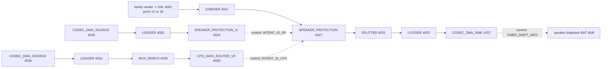

# SP11 canonical Windows/Linux graph ledger — 2026-07-25

## Status

This is the implementation baseline for the SP11 speaker path. It supersedes
diagrams assembled from donor topology names, partial `stream6` grafts, or
unbounded binary scans.

The recovered evidence proves two mirrored Windows render-mode families:

- DEFAULT family A: subgraphs `0xb000007e` and `0xb000007f`;
- NOTIFICATION family B: subgraphs `0xb0000082` and `0xb0000083`;
- shared root/protection subgraph: `0xb0000001`.

Older project notes incorrectly call these left and right. Static GKV rows and
the exact Windows miniport/QCADCM translation prove that both use endpoint key
value `1`; only the stream and mix processing-mode keys differ. Family A is
DEFAULT (`2`) and family B is NOTIFICATION (`7`). They are mutually selected
mode alternatives, not the physical speaker halves.

The current Linux MM1 graph is not a reduced version of this structure. It is
a donor-shaped serial chain with no shared Windows root, no speaker-protection
modules, no VI graph, and no equivalent per-family split.

## Evidence notation

| Tag | Meaning |
|---|---|
| `[KD]` | Exact bytes from a live Windows KDNET `GRAPH_OPEN` or `SET_CFG` out-of-band body |
| `[QGPR]` | Exact live AudioReach packet decoded from an older QGPR capture |
| `[ACDB]` | Static Windows REV_0D ACDB table or SCLU relationship |
| `[HDR]` | Module or parameter identity from recovered AudioReach API headers |
| `[FW]` | Exact registration record or executable behavior in the recovered Windows DSP firmware |
| `[DRV]` | Exact executable behavior in a hash-bound recovered Windows driver |
| `[INF]` | Exact configuration value in a hash-bound recovered Windows INF |
| `[LINUX]` | Exact decode or snapshot of the installed Linux stack |
| `[HYP]` | Hypothesis; forbidden as an implementation input until promoted by evidence |

“Live” proves that Windows submitted the recorded body. It does not, by itself,
prove graph lifetime overlap or acoustic purpose.

## Canonical sources

| Source | SHA-256 | Role |
|---|---|---|
| KD capture log | `386aabc5cc7a98c67031748826c98386badf41d23e67e4cbaa23ca6690e919aa` | Ordered debugger evidence |
| family A full body | `001e8f78c2aed10e74faad7c2f70095f307a52d4590ec0d00e785e57f44a006e` | Root + `7e` + `7f`; captured four times byte-identically |
| family B full body | `a0d4b5a0fa9102a428402ecd9ad19967e73e74b302fb4e67378d76dc49725a46` | Root + `82` + `83`; captured once |
| family B render-only body | `d4b009f53961de29ca81226bd5f0cbe5f37e94c9f7b5224aee4fa3ffc65d1c4c` | `82` + `83`; captured twice byte-identically |
| QGPR activation inventory | `81c4f213f7c13e7f346aa39c2b163ba2fcfd50877495078931ca49fa76e660b1` | Earlier live `GRAPH_START` lists |
| static GKV inventory | `eaaee9502eb355755406b9ed1b7b347e7446589d9e43d59069628a8c78c18d9a` | Static graph selectors and POOL bodies |
| static SCLU inventory | `dfb379a903de4053cd4407b023a89d786a54d0bdd01bdca0eb0f33b0c79871f6` | Static cross-subgraph relationships |
| reviewed root-splitter peers | `e5c7673367056cb6a98109bc80de6e4fadf00483c0395e706b65c1630c275a4c` | Classifies ports 5/9/11 as optional capture SPEECH/COMMUNICATIONS branches |
| REV_0D ACDB | `a0a8635ba65127180a1caef46af61c00171c9a93cbf8b5f5650709b4638decde` | Original Windows static calibration database |
| full QGPR CFG trace | `3a2b03868033cff3a147e4e120f05809b957da276217d963e457683b1fae2ca0` | Live root-protection command order and bodies |
| reviewed root-protection CFG inventory | `e0eb0a8cdace2d9be5cce4cdf8ab122bb7f77a233baec8b910541c118b0d1716` | Strict decode of live SP/SP_VI configuration, including the two-speaker R0/T0 body |
| reviewed protection startup sequence | `2db4337a95ad1a568155bc71d45e0e852c7bafc1031b4cd53cc01e6c6b3330bc` | Seven live protection initializations including graph, SP, and SP_VI OOB calibration positions |
| reviewed DEFAULT control-link topology data | `b22c326ea8b8581105c871a04d40c45303cec6ad7eafcf36786537f9409eb311` | Byte-exact reconstruction of the two captured Windows control-link payloads plus the Linux aggregate form |
| QCADCM INF | `4d9443dad9b25979d523b736e18a6676f568f1410a91cf6da1543f4dacbfcd0b` | Installed 8 kHz/32-bit SP_VI endpoint policy |
| reviewed Windows INF format inventory | `5db9cd4c5999941ab0bf41449ae954c99f2f7040ef7c65302e0280bdbff4d76d` | Strict inventory of speaker host/offload/loopback formats and VI registry values |
| Surface AUCD extension INF | `eae4bc6c98288f7e5a4ca793655d1072b16cf8b97cb352606b63b778d65c2402` | MSHW0486 has one enabled WSA/SoundWire macro instance and only the SWR_WSA interrupt |
| reviewed QGPR lifecycle summary | `81454093ddd7e1712f0e5290726f087f0af09f73ee2af3d2206c8065bc4ac2a9` | Corrected live OPEN/START/STOP/CLOSE inventory from four recovered traces |
| Windows ADSP firmware | `921870a839ee2aba647b04598d62ed96f3d2d5dfbb2499fc842f9a6ff0e0da13` | Static module registration and executable CAPI behavior |
| QCADCM Windows driver | `37f76305ac8051b0b03b6d2ce1df7a353253debf546e512e447c9d95ec661429` | Render selector, enum-to-GKV translation, and SP/SP_VI R0/T0 payload construction |
| QCAUD miniport Windows driver | `79b26804d05332304c736c4e03e942db6a07ea886a2b07f3a4ff5947d1d05531` | Windows mode-GUID to QCADCM processing-enum translation |
| Surface audio miniport extension INF | `5acd5091f45da4232945046eeedc913bff75c57adc6e17954391264d7cec8134` | Advertised processing modes and canonical GUID values |
| reviewed render-mode/loopback mapping | `9c4ab3c0ce8f914020da433afc2923cb27af56ee7a662ff732dd89fcb5156298` | Bound DEFAULT/NOTIFICATION selectors and speaker-loopback role |
| installed Linux topology decode | `066182f47d74f4a8be6d878d1cae226d02dcab2fc858bd1f684931fa5d135485` | Current Linux comparison point |

Reviewed machine-readable outputs are in
`artifacts/reviewed/windows-kdnet-20260723/`. The manifest binds every
generated JSON file to the original capture name and SHA-256.

## Runtime submission facts

`[KD]` The fresh capture contains seven graph bodies but only three unique
byte sequences:

| Submitted set | Captures | Bytes | Parameters | Modules | Data connections | Control links |
|---|---:|---:|---:|---:|---:|---:|
| root + `7e` + `7f` | 4 | `0xb18` | 19 | 29 | 30 | 4 |
| root + `82` + `83` | 1 | `0xb18` | 19 | 29 | 30 | 4 |
| `82` + `83` only | 2 | `0x5e0` | 13 | 16 | 17 | 1 |

For each full body, the 30 connections resolve as:

- 24 internal to one subgraph;
- 2 cross-subgraph bridges;
- 4 destinations outside the submitted set.

`[QGPR]` Earlier captures prove these exact `GRAPH_START` lists:

| Start sequence | Subgraphs |
|---:|---|
| 31 | `01 + 7f + 7e` |
| 80 | `01 + 83 + 82` |
| 5769 | `01 + 7f + 7e` |
| 10399 | `01 + 7f + 7e` |

Other captured starts (`44 + 40 + 41` and `01 + 27 + 26`) exist but are not
part of this speaker-render baseline.

`[QGPR][HDR]` Re-auditing four recovered full QGPR CSVs closes part of the
lifecycle gap. They contain 52 graph-lifecycle commands:

| Command | Correct opcode | Captures |
|---|---:|---:|
| GRAPH_OPEN | `01001000` | 14 |
| GRAPH_START | `01001002` | 13 |
| GRAPH_STOP | `01001003` | 12 |
| GRAPH_CLOSE | `01001004` | 13 |
| GRAPH_PREPARE | `01001001` | 0 |
| GRAPH_FLUSH | `01001005` | 0 |

The recovered CSV decoder incorrectly named opcode `01001004`
`APM_CMD_GRAPH_FLUSH`. Both the recovered AudioReach `apm_api.h` and Linux
7.1.5 `audioreach.h` define it as `APM_CMD_GRAPH_CLOSE`; actual GRAPH_FLUSH is
`01001005`.

The full trace proves these ordered examples on source port `2010`:

| Set | OPEN | START | STOP | CLOSE |
|---|---:|---:|---:|---:|
| root + `7f` + `7e` | 3 | 31 | 36 | 40 |
| root + `83` + `82` | 52 | 80 | 85 | 89 |
| `44` + `40` + `41` | 101 | 168 | 9557 | 9561 |
| root + `27` + `26` | 9727 | 9757 | 9766 | 9770 |

OPEN and CLOSE are 40-byte out-of-band descriptors in these CSVs. The exact
START and STOP subgraph lists are present in-band. The OPEN bodies are bound
separately by the activation inventory; the CLOSE bodies were not retained.

The same trace proves overlapping active intervals between `44 + 40 + 41`
(`START 168`, `STOP 9557`, source `2010`) and family A
(`START 5769`, `STOP 9716`, source `2011`).

`[DRV][ACDB]` The sequential family A/family B lifetimes are consistent with
their now-proven roles as DEFAULT and NOTIFICATION mode alternatives.
Simultaneous A/B lifetime is not a Linux parity requirement. The fresh
2026-07-23 run itself has no lifecycle commands.

## Shared root/protection graph `0xb0000001`

### Exact module inventory

| Container | IID | Module ID | Canonical name | Ports in/out |
|---|---|---|---|---:|
| `e0000001` | `4001` | `07001010` | SAL | 10/1 |
| `e0000001` | `4002` | `07001011` | SPLITTER | 1/7 |
| `e0000001` | `4003` | `0700101a` | DATA_LOGGING | 1/1 |
| `e0000001` | `4157` | `07001023` | CODEC_DMA_SINK | 1/0 |
| `e0000001` | `4027` | `070010e2` | SPEAKER_PROTECTION | 1/1 |
| `e0000001` | `402c` | `07001013` | CHMIXER | 1/1 |
| `e0000007` | `4024` | `070010e3` | SPEAKER_PROTECTION_VI | 1/1 |
| `e0000007` | `4025` | `0700101a` | DATA_LOGGING | 1/1 |
| `e0000007` | `4026` | `07001024` | CODEC_DMA_SOURCE | 0/1 |
| `e0000006` | `4028` | `070010e4` | CPS_DATA_ROUTER_V5 | 1/0 |
| `e0000006` | `4029` | `07001098` | MUX_DEMUX | 2/1 |
| `e0000005` | `402a` | `0700101a` | DATA_LOGGING | 1/1 |
| `e0000005` | `402b` | `07001024` | CODEC_DMA_SOURCE | 0/1 |

### Exact connected components



The ordinary render path is:

```text
4001:1 -> 402c:2 -> 4027:2 -> 4002:2 -> 4003:2 -> 4157:2
```

The VI component is:

```text
4026:1 -> 4025:2 -> 4024:2
```

The auxiliary capture component is:

```text
402b:1 -> 402a:2 -> 4029:2 -> 4028:2
```

The splitter also has exact external destinations:

```text
4002:9  -> 47c9:2
4002:5  -> 4747:2
4002:11 -> 4730:2
```

`[ACDB][DRV][QGPR]` These three destinations are capture-side branches, not
additional physical speaker outputs. Their owning rows use the capture GKV
schema: `4747` and `47c9` select SPEECH processing, while `4730` selects
COMMUNICATIONS processing. All three destinations are `MFC` inputs. None of
their subgraphs (`8c`, `9a`, `8a`) occurs in any of the 13 recovered
`GRAPH_START` lists or the corresponding stop lists. A speaker-only baseline
must preserve their documented identities but must not instantiate them;
they belong to later microphone/capture parity work. Exact selectors and
source hashes are in
`artifacts/reviewed/windows-root-splitter-capture-peers.json`.

There is no `[KD]` data-port `MODULE_CONN` from `SP_VI 4024` to
`SPEAKER_PROTECTION 4027`. There is, however, an exact
`APM_PARAM_ID_MODULE_CTRL_LINK_CFG` relationship:

```text
4024:80000000 <-> 4027:80000000  INTENT_ID_SP (08001204)
4028:80000000 <-> 4027:80000001  INTENT_ID_CPS (08001537)
4157:80000007 <-> 40df:c0000001  INTENT_ID_TIMER_DRIFT_INFO (080010c2)
```

`[ACDB][HDR]` IID `40df` is `MODULE_ID_RATE_ADAPTED_TIMER` (`07001041`) in
subgraph `b0000045`. The SP_VI/SP relationship is therefore a control link,
not a data edge. An implementation must preserve that distinction.

`[ACDB][DRV][INF][HDR]` Subgraphs `b0000045 + b0000046` are the speaker
loopback graph. The Surface INF binds `WaveSpeaker\FormatsAndModes3` as type
`loopback`; the miniport maps that type to streaming enum `3`; and the exact
ACDB row selects capture stream/mix GKV `3` plus speaker render endpoint `1`.
Its terminal module `07001007`, IID `40e5`, is
`MODULE_ID_SH_MEM_PUSH_MODE`. The timer-drift link therefore synchronizes a
host loopback capture with the hardware render clock.

`[FW][HDR][KD]` Module `070010e4` is the Speaker Protection v5 CPS Data
Router. Its exact Windows ADSP firmware registration record points to a CAPI
implementation whose set-parameter handler accepts
`PARAM_ID_CPS_CHANNEL_MAP_V5` (`080013cb`),
`PARAM_ID_MODULE_ENABLE` (`08001026`), and IMCL port operations, and whose
control-port setup uses `INTENT_ID_CPS` (`08001537`). This independently
matches the recovered CPS router API and the live module's 1/0 port shape.
The full evidence chain is recorded in
`docs/findings/2026-07-26-qcadsp-e4-cps-data-router.md`.

### Root CODEC_DMA hardware interface

`[ACDB][DRV][HDR]` The module-tag lookup for root `b0000001`, endpoint tag key
`04010003`, resolves four permitted configurations for `CODEC_DMA_SINK 4157`.
All four select `PARAM_ID_CODEC_DMA_INTF_CFG` with:

```text
lpaif_type=2 (LPAIF_WSA), interface_index=1
```

The rows are fixed-point PCM at 48 kHz: 16- or 24-bit, with either two
channels/mask `00000003` or four channels/mask `0000000f`. Live QGPR parameter
`080011f5`, decoded against the QCADCM construction path, proves that this
machine selected two protected speaker channels. The installed Surface
miniport INF exposes 28 non-loopback speaker formats and every one is 16-bit;
its only 24-bit speaker format belongs to the separate loopback pin. QCAUD
reads that endpoint bit width and QCADCM converts it through `GetBitWidthKV`
for the root/protection selector. The selected playback endpoint is therefore
48 kHz, 16-bit, two channels/mask `00000003`, on WSA interface 1.
The complete MTKT → MTKL/MTLU → MTDE/MTDO → POOL closure is retained in
`artifacts/reviewed/windows-root-codec-dma-hwif.json`.

`[LINUX]` The installed `device105.codec_dma_rx1` already has hardware
interface index `1`, interface type `2` (`LPAIF_WSA`), and fixed-point format
`1`. Linux derives the same two/four-channel masks from the negotiated channel
count. This narrow backend boundary matches Windows; it does not validate the
donor graph before it or the physical SoundWire/amp mapping after it.

`[QGPR][DRV]` Seven byte-identical live `SET_CFG` packets to `SP_VI 4024`,
parameter `080011f5`, begin with channel count `2` and carry two eight-byte
R0-Q24/T0-Q6 calibration records. QCADCM function `0x140085270` verifies equal
SP/SP_VI speaker counts, reads one R0/T0 pair per channel, constructs exactly
this count-plus-records layout, and submits it. The reviewed body and decoded
values are in `artifacts/reviewed/windows-qgpr-root-protection-cfg.json`.

`[ACDB][HDR]` Root tag key `04010005` independently configures the VI
`CODEC_DMA_SOURCE 4026` as WSA interface 1, fixed-point, 32-bit, with 2/4
channels and a matching `00000003`/`0000000f` mask at either 8 or 48 kHz.
The live count selects the 2-channel/mask `00000003` alternative. SP_VI tag
key `0401000b` consequently selects four ordered values: speaker 1
Vsens/Isens, followed by speaker 2 Vsens/Isens.

`[INF][DRV][ACDB]` QCADCM's installed `SpkrProtVIInfo` policy is exactly
8 kHz/32-bit. Its driver reads those values, combines them with the graph's
two-channel count, converts all three to graph keys, resolves the endpoint
hardware interface, and submits it. The selected two-speaker static SP_VI
payload independently contains `sampling_rate=8000`. Windows therefore has a
concrete 8 kHz, 32-bit, two-channel WSA feedback endpoint; the current Linux
sound card's missing
`WSA_CODEC_DMA_TX_0` link is an exact structural gap.

The installed MSHW0486 AUCD policy has exactly one enabled WSA slave type,
SoundWire interface, macro instance 0, and `SWR_WSA` interrupt. It does not
install the documented `SWR_WSA2` interrupt. The running Linux system matches:
one `sdw-master-1-0` and two WSA8845 slaves at link addresses `0` and `1`.
Recovered four-amplifier/two-macro notes and their two-VI-link A/B proposal are
not applicable to SP11. The Linux implementation target is one two-channel
TX0 backend into `lpass_wsamacro` DAI 2; this DAI-name translation remains a
high-confidence Linux implementation deduction pending a muted boot test.

## DEFAULT render family A — `0xb000007e` + `0xb000007f`

`[DRV][ACDB]` The complete six-key selector for this family is:

```text
01000001=2  render stream type
01000002=2  render stream processing mode = DEFAULT
01000003=1  render stream instance
01000004=2  render mix type
01000005=2  render mix processing mode = DEFAULT
01000006=1  render endpoint
```

The miniport maps the DEFAULT GUID to QCADCM processing enum `2`; QCADCM maps
that enum to GKV value `2`.

`[KD]` The complete path, including supplemental cross-subgraph connections,
is:

```mermaid
flowchart LR
    PULL["SH_MEM_PULL 4660"] --> L1["LOGGER 465c"]
    L1 --> CNV["PCM_CNV 465f"]
    CNV --> V1["VOL_CTRL 4663"]
    V1 --> SWR1["SWR_SINK 4662"]
    SWR1 --> EQ["POPLESS_EQ 4664"]
    EQ -. "control: P_EQ_VOL_HEADROOM" .-> V1
    EQ --> V2["VOL_CTRL 4669"]
    V2 --> MFC["MFC 466a"]
    MFC --> PAUSE["SOFT_PAUSE 466b"]
    PAUSE --> SPR["SPR 412b<br/>1 input / 2 outputs"]
    SPR --> L2["LOGGER 47e9"]
    L2 --> V3["VOL_CTRL 4a63"]
    V3 --> SWR2["SWR_SINK 4675"]
    SWR2 --> IIR1["MSIIR 489e"]
    IIR1 --> IIR2["MSIIR 48a1"]
    IIR2 --> L3["LOGGER 467a"]
    L3 --> ROOT["root SAL 4001:12"]
    SPR -. "loopback tap, port 3" .-> EXT["loopback SAL 4144:16"]
```



The two connections that join the subgraph records are directly present as
supplemental `MODULE_CONN` parameters in the live body:

```text
412b:1 -> 47e9:2
467a:1 -> 4001:12
```

This independently matches the earlier `[ACDB]` SCLU bridge decode.

The live body also carries this internal control link:

```text
4664:80000000 <-> 4663:80000000
INTENT_ID_P_EQ_VOL_HEADROOM (08001118)
```

Exact module grouping:

| Subgraph/container | IID | Module ID | Name | Ports in/out |
|---|---|---|---|---:|
| `7e/e000004c` | `4660` | `07001006` | SH_MEM_PULL_MODE | 0/1 |
| `7e/e000004c` | `465c` | `0700101a` | DATA_LOGGING | 1/1 |
| `7e/e000004c` | `465f` | `07001003` | PCM_CNV | 1/1 |
| `7e/e000004c` | `4663` | `0700101b` | VOL_CTRL | 1/1 |
| `7e/e000004c` | `4662` | `07001097` | SWR_SINK | 1/1 |
| `7e/e000004c` | `4664` | `07001045` | POPLESS_EQUALIZER | 1/1 |
| `7e/e000004c` | `4669` | `0700101b` | VOL_CTRL | 1/1 |
| `7e/e000004c` | `466a` | `07001015` | MFC | 1/1 |
| `7e/e000004c` | `466b` | `07001019` | SOFT_PAUSE | 1/1 |
| `7e/e0000066` | `412b` | `07001032` | SPR | 1/2 |
| `7f/e0000114` | `47e9` | `0700101a` | DATA_LOGGING | 1/1 |
| `7f/e0000114` | `4a63` | `0700101b` | VOL_CTRL | 1/1 |
| `7f/e0000114` | `4675` | `07001097` | SWR_SINK | 1/1 |
| `7f/e0000114` | `489e` | `07001014` | MSIIR | 1/1 |
| `7f/e0000114` | `48a1` | `07001014` | MSIIR | 1/1 |
| `7f/e0000114` | `467a` | `0700101a` | DATA_LOGGING | 1/1 |

## NOTIFICATION render family B — `0xb0000082` + `0xb0000083`

`[DRV][INF][ACDB]` The complete six-key selector for this family is:

```text
01000001=2  render stream type
01000002=7  render stream processing mode = NOTIFICATION
01000003=1  render stream instance
01000004=2  render mix type
01000005=7  render mix processing mode = NOTIFICATION
01000006=1  render endpoint
```

The Surface INF defines the NOTIFICATION GUID as
`9CF2A70B-F377-403B-BD6B-360863E0355C`. The miniport maps it to QCADCM
processing enum `7`; QCADCM maps that enum to GKV value `7`.

`[KD]` Family B is structurally isomorphic to family A:

```text
469e SH_MEM_PULL
 -> 469a LOGGER
 -> 469d PCM_CNV
 -> 46a1 VOL_CTRL
 -> 46a0 SWR_SINK
 -> 46a2 POPLESS_EQ
 -> 46a7 VOL_CTRL
 -> 46a8 MFC
 -> 46a9 SOFT_PAUSE
 -> 4137 SPR
 -> 47ed LOGGER
 -> 4a5f VOL_CTRL
 -> 46b3 SWR_SINK
 -> 48a8 MSIIR
 -> 48a9 MSIIR
 -> 46b8 LOGGER
 -> root SAL 4001:18
```

Exact supplemental bridges:

```text
4137:1 -> 47ed:2
46b8:1 -> 4001:18
```

Exact speaker-loopback branch:

```text
4137:3 -> 4144:24
```

Exact internal control link:

```text
46a2:80000000 <-> 46a1:80000000
INTENT_ID_P_EQ_VOL_HEADROOM (08001118)
```

The family contains 16 modules: ten in `82`, six in `83`. Module IDs and
port counts match family A position-for-position; only IIDs, containers, root
SAL input port, and the final external destination port differ.

## Corrected module identities

Four old project labels are now resolved by `[HDR][FW]` evidence:

| Module ID | Canonical API identity | Consequence |
|---|---|---|
| `07001006` | `MODULE_ID_SH_MEM_PULL_MODE` — Shared Memory Pull Mode Endpoint | It is the Windows render source in these bodies, not an unknown codec stage |
| `0700101b` | `MODULE_ID_VOL_CTRL` | “SAL_V2” is an incorrect semantic name for this ID |
| `07001032` | `MODULE_ID_SPR` — Splitter Renderer | The Linux `UNKNOWN_0x32` label hides a required fan-out stage |
| `070010e4` | Speaker Protection v5 CPS Data Router | It carries the v5 CPS channel map and opens the CPS intent to the SPv5 module |

`SPR` is declared as 1 input / 2 outputs in both live Windows families.
The current Linux instances declare 1 input / 1 output. That is not a naming
issue; it structurally amputates the second Windows output.

`[FW][HDR]` Module `070010e4` is registered in the recovered Windows ADSP
firmware with init function `0xb03ed820`. Its set-parameter handler accepts
`PARAM_ID_CPS_CHANNEL_MAP_V5 (080013cb)`, module enable, and IMCL port
operation, then opens `INTENT_ID_CPS (08001537)`. The live graph's one-input,
zero-output ports match the recovered Speaker Protection v5 CPS Data Router
API. It is not a Dolby or equalizer stage.

The other exact live control-link intents resolve from AudioReach headers as:

| Intent ID | API identity | Live peers |
|---|---|---|
| `08001204` | `INTENT_ID_SP` | SP_VI `4024` ↔ SP `4027` |
| `08001537` | `INTENT_ID_CPS` | CPS_DATA_ROUTER_V5 `4028` ↔ SP `4027` |
| `080010c2` | `INTENT_ID_TIMER_DRIFT_INFO` | DMA sink `4157` ↔ rate-adapted timer `40df` |
| `08001118` | `INTENT_ID_P_EQ_VOL_HEADROOM` | popless EQ ↔ first VOL_CTRL in each render family |

## Live dynamic volume-control evidence

`[KD][HDR]` All fourteen captured `SET_CFG` bodies target `VOL_CTRL`, not
“SAL_V2”:

- target IID `4a63` or `4a5f`;
- `PARAM_ID_VOL_CTRL_MULTICHANNEL_GAIN` (`08001038`) or
  `PARAM_ID_VOL_CTRL_MULTICHANNEL_MUTE` (`08001039`);
- eight declared channel-map entries in a `0x68`-byte payload;
- channel masks `0x2` and `0x4` carry the observed non-zero gain values;
- mute values observed are zero.

The observed Q28 gain values decode to:

| Q28 value | Linear gain | Approximate dB |
|---|---:|---:|
| `0013615a` | `0.0047315136` | `-46.50 dB` |
| `007dda19` | `0.0307255723` | `-30.25 dB` |

One body is transitional: mask `0x2` has `007dda19` while mask `0x4` still has
`0013615a`. Later bodies carry the new value on both. The differing per-channel
values are direct evidence; the interpretation that this is a staged gain
update is `[HYP]` until the commands are tied to timestamped Windows volume
events. It is a concrete candidate mechanism to compare against the historical
“volume knob” symptom, but it does not prove the Linux spike cause.

The capture was filtered and does not inventory every Windows `SET_CFG`.
Absence of SP/SP_VI parameters in these fourteen small bodies is not evidence
that Windows sends none.

## Root-protection configuration evidence

The recovered corpus contains two different configuration layers. They must
not be flattened into one “Windows calibration” blob.

### Static REV_0D mappings

`[ACDB]` A strict CDLU → CDDE/CDDO → POOL decode finds 32 unique static
mappings across the four root targets:

| Target | Module | Mappings | Payload bytes |
|---|---|---:|---:|
| `4024` | SP_VI | 9 | 1,256 |
| `4027` | SP | 18 | 5,522 |
| `4028` | CPS_DATA_ROUTER_V5 | 1 | 4 |
| `4157` | CODEC_DMA_SINK | 4 | 16 |

The largest SP_VI block is 1,044 bytes (`08001384`). The largest SP blocks are
1,520 bytes (`08001258`), 2,188 bytes (`0800134a`), 612 bytes (`0800150e`),
and 988 bytes (`08001532`). Every mapping retains its CDLU position, CDDE/CDDO
group offsets, POOL offset, size, payload bytes, and SHA-256 in
`artifacts/reviewed/windows-acdb-rev0d-root-protection-setcfg.json`.

The following identities are directly resolved by `[HDR]`:

| Target | Param ID | API identity |
|---|---|---|
| SP/SP_VI | `08001026` | `PARAM_ID_MODULE_ENABLE` |
| SP/SP_VI | `080010a6` | `PARAM_ID_RTM_LOGGING_ENABLE` |
| SP_VI | `080011c2` | `PARAM_ID_VI_OUTPUT_SPLIT_ENABLE` |
| SP_VI | `080011f6` | `PARAM_ID_SP_VI_STATIC_CFG` |
| SP_VI | `08001203` | `PARAM_ID_SP_VI_CHANNEL_MAP_CFG` |
| SP_VI | `08001364` | `PARAM_ID_SP_VI_CFSMOOTHING_CFG_PARAM` |
| SP_VI | `08001510` | `PARAM_ID_MAX_RATED_TEMP` |

Several large OEM parameter IDs are not present in the recovered public API
headers. Their bytes are preserved but their semantics remain unresolved.

Static ACDB presence proves neither runtime selection nor send order. Earlier
project tooling discarded duplicate `(IID,param)` mappings by keeping the
first POOL offset; the new inventory deliberately preserves variants. For
these four targets, the selected REV_0D decode happens to contain one payload
variant per `(IID,param)`, but that result is now checked rather than assumed.

### Live complete command sequence

`[QGPR]` A surviving full trace contains 48 root-protection CFG events:
28 `SET_CFG` commands and 20 `GET_CFG` requests. Seven repeated cycles contain
the in-band sequence below:

```text
SP    4027  SET 080011e9  size 8   payload 0000000000000000
SP    4027  GET 080011e8  request size 68
SP_VI 4024  GET 080011f6  request size 44
SP_VI 4024  SET 080011f5  size 24
              0200000070b2f404aa0900001ed65e054009000000000000
SP_VI 4024  SET 080011f4  size 24
              020000000000000000000000000000000000000000000000
SP_VI 4024  SET 080011ff  size 8   payload 0000000000000000
SP    4027  GET 080011f2  request size 68
```

The trace identifies `080011e9` as `PARAM_ID_SP_OP_MODE_V5`. Recovered
implementation evidence labels `080011f4` as SP_VI operating-mode config,
`080011f5` as R0/T0 config, and `080011ff` as SP_VI excursion-mode config;
the exact Windows IDs, sizes, and bodies above remain the canonical facts.

The original decoder intentionally omitted out-of-band commands. Re-decoding
the same trace around each protection anchor proves all seven initializations
also contain:

```text
GRAPH_OPEN
  -> graph/subgraph calibration OOB SET_CFG (10464 bytes x5, 9872 bytes x2)
  -> SP 080011e9 mode
  -> SP-tag calibration OOB SET_CFG (1888 bytes x7)
  -> SP/SP_VI GETs and the three dynamic SP_VI SETs above
  -> SP_VI-tag calibration OOB SET_CFG (1328 bytes x7)
  -> VI endpoint/hardware configuration
  -> GRAPH_START when that graph is started in the retained interval
  -> SP 080011f2 telemetry GET (six complete; final trace tail truncated)
```

`[DRV]` QCADCM calls `GSL_CMD_ADD_GRAPH`, which opens the selected subgraphs
and immediately calls `gsl_graph_set_sg_cal`. That path queries ACDB for
non-persistent, persistent, and global-persistent calibration and sends it
through `SET_CFG`. The live OOB command immediately after each `GRAPH_OPEN`
is therefore the graph/subgraph calibration boundary. CDLU binds the exact
root IIDs to the reviewed ordered root group; SP_VI occupies rows 9..17 and
SP rows 25..42.

The GET packets still contain request buffers rather than responses, but the
topology-critical result is now closed. QCADCM extracts the SP and SP_VI
speaker counts, requires equality, and constructs the next captured R0/T0
body with two channels. Both returned counts are therefore exactly two.
`080011f2` is the post-start `GetSpkrProtTMaxXMaxParameters` telemetry query,
not a graph-construction input. Full returned telemetry bytes remain useful
for bring-up safety but do not block construction of a disabled topology.

Reviewed command evidence is in
`artifacts/reviewed/windows-qgpr-root-protection-cfg.json` and
`artifacts/reviewed/windows-qgpr-root-protection-startup-sequence.json`.

## Current Linux MM1 comparison point

`[LINUX]` Installed topology SHA-256:

```text
4e00057b8e316c217347bcdee0af0c6d4ff40e8e0f1870d7efeaddc2669ff54e
```

Its MM1 serial path is:

```text
6001 WR_SHARED_MEM_EP
 -> 6002 PCM_DEC
 -> 6003 PCM_CNV
 -> 6008 SWR_SINK
 -> 600c VOL_CTRL (misnamed SAL_V2)
 -> 6009 POPLESS_EQ
 -> 6004 VOL_CTRL (misnamed SAL_V2)
 -> 6007 SAL
 -> 6005 MFC
 -> 600a SOFT_PAUSE
 -> 600b SPR (misnamed UNKNOWN_0x32, declared 1/1)
 -> 6006 DATA_LOGGING
 -> 6050 DATA_LOGGING
 -> 6051 MFC
 -> 6052 CODEC_DMA_SINK
```

Four similar donor stream chains exist. MM1 selects `stream0` and joins the
single WSA backend at DAPM graph set 105. This is not the Windows model of a
render family feeding a shared protection root.

### Structural difference ledger

| Area | Windows fact | Current Linux | Required disposition |
|---|---|---|---|
| Source endpoint | `SH_MEM_PULL_MODE` in each observed render family | `SH_MEM_PULL_MODE` with mapped ring and position page | Full QGPR plus recovered Qualcomm source proves this is the required DSP contract; the earlier `WR_SHARED_MEM_EP` substitution is retired |
| Family structure | DEFAULT and NOTIFICATION are mirrored 16-module alternatives | One selected donor serial chain into a common backend | Rebuild DEFAULT from explicit subgraphs and bridges; reserve NOTIFICATION as an alternate selector |
| Early stage order | `PCM_CNV -> VOL -> SWR -> EQ -> VOL` | `PCM_CNV -> SWR -> VOL -> EQ -> VOL` | Correct order from selected Windows family |
| Post-pause fan-out | `SPR` is 1/2; output 1 continues toward hardware, output 3 is a speaker-loopback tap to `4144` | `SPR` is 1/1 with one serial output | Restore the port declaration; keep loopback disabled or implement it separately, never route it to hardware |
| Downstream render stages | second `VOL -> SWR -> MSIIR -> MSIIR -> LOGGER` | absent | Add only from exact family record |
| Shared root ingress | family logger feeds SAL input 12 or 18 | no equivalent root SAL fan-in | Implement exact root ingress/ports |
| Root render path | `SAL -> CHMIXER -> SP -> SPLITTER -> LOGGER -> DMA` | `SAL` is inside donor stream; no CHMIXER/SP/SPLITTER | Implement exact shared root |
| SP module | `070010e2`, 1/1 | absent | Required |
| SP_VI module | `070010e3`, 1/1 | absent | Required |
| VI transport | `4026` is WSA interface 1, 8 kHz, 32-bit, 2 channels/mask `3`; SP_VI expects `[SP1 V,I, SP2 V,I]`; MSHW0486 has one WSA macro | One WSA master/two amps are correct; WSA TX0/VI DAI link absent; VISENSE and VI mixers off | Add one `WSA_CODEC_DMA_TX_0 -> lpass_wsamacro DAI 2` link and validate ports 10/11 with amps muted |
| SP/SP_VI data edge | none in live `MODULE_CONN` | none | Do not invent one |
| SP/SP_VI control link | exact `INTENT_ID_SP` control link | topology driver has no control-link model or serializer; offline candidate `0003` adds one | Implement as a control link, not an audio edge |
| Other control links | CPS, timer-drift, and EQ/headroom links are exact | same driver capability gap; both captured payload hashes are now reproduced exactly | Preserve exact peer ports and intents |
| Root external edges | splitter feeds MFC IIDs `47c9`, `4747`, `4730` in capture SPEECH/COMMUNICATIONS SGs `9a`, `8c`, `8a`; none occurs in 13 recovered starts | absent | Exclude from speaker-only baseline; preserve exact identities for later capture parity |
| Render loopback edge | SPR port 3 feeds speaker-loopback SAL `4144`; SGs `45/46` terminate at `SH_MEM_PUSH_MODE 40e5` | absent | Optional for initial playback; preserve a disabled output-3 route until loopback is implemented |
| Backend model | root contains CODEC_DMA sink and sources; sink uses WSA interface 1, fixed-point, 48 kHz, 16-bit, 2 channels/mask `3` | separate donor device105 logger/MFC/DMA chain; DMA tokens already select WSA interface 1 and fixed-point | Reuse the proven DMA interface tokens, but replace donor graph assumptions |
| Dormant backend | no conclusion from Windows bodies | DAPM set 106 names RX1 while module token uses graph 107 and kernel DAI 106 is TX0 | Remove from new baseline |
| Dynamic gain | exact per-channel Q28 `VOL_CTRL` updates observed | topology names hide module identity; runtime parity unproven | Capture and compare update ordering before diagnosing spikes |
| Dolby | no Dolby AudioReach module in these bodies | active PipeWire EQ changes samples | Keep a userspace identity/bypass insertion point; disable EQ for parity tests |

## Dolby boundary

The hardware ledger ends at the userspace/hardware handoff:

```text
application
  -> userspace Dolby insertion point (identity/bypass for this project)
  -> AudioReach hardware graph
  -> WSA macro / SoundWire
  -> WSA884x amplifiers
```

No Dolby-specific DSP module appears in any of the three unique live graph
bodies. A Linux Dolby placeholder must therefore be a userspace identity node,
not a fabricated AudioReach module. The currently active PipeWire speaker EQ
is not that placeholder because it modifies samples.

## Implementation invariants

The next topology may not be called a Windows structural baseline unless all
of these are true:

1. Every module ID, IID policy, port count, and data edge has a row in this
   ledger or a newer reviewed capture.
2. `VOL_CTRL`, `SPR`, and `SH_MEM_PULL_MODE` use their canonical identities;
   legacy `SAL_V2` and `UNKNOWN_0x32` names are not used as semantics.
3. The selected render family contains both subgraphs and both supplemental
   bridges.
4. `SPR` has both proven outputs; no serial 1/1 substitute is accepted.
5. The shared root contains SP and SP_VI exactly as recorded.
6. No direct SP_VI-to-SP data edge is invented; the exact SP control link is
   represented instead.
7. All four live control links preserve peer IIDs, control-port IDs, intent
   IDs, and heap property.
8. Loopback peers `4144` and `40df` remain confined to the speaker-loopback
   graph; they cannot be used as hardware speaker destinations.
9. External peers `47c9`, `4747`, and `4730` retain their statically resolved
   capture-side identities and are omitted from the speaker-only baseline.
10. The WSA VI transport exists before protection is enabled.
11. The protection baseline uses exactly two speaker channels and SP_VI map
    `[1,2,3,4]`; the unused four-speaker ACDB alternative is not instantiated.
12. Only calibration blocks with an exact source, target IID/module policy,
   size, hash, and ordering rule are admitted.
13. Dolby remains a bypassed userspace insertion point and cannot conceal a
    missing hardware stage.
14. The PipeWire EQ is bypassed during every structural or Windows-reference
    comparison.
15. DEFAULT family A and NOTIFICATION family B remain selector alternatives;
    they are never joined as physical left/right paths.
16. Bring-up begins muted and does not drive the speakers before VI telemetry
    and rollback behavior are proven.

## Open facts blocking safe deployment

| Priority | Missing fact | How to close it |
|---|---|---|
| P0 | Linux WSA playback+VI SoundWire transport behavior | Instrument a reproducible kernel with amplifiers muted |
| P1 | Final physical binding after proven single WSA interface | Linux maps left/right amp addresses 0/1 to master DAC 1/4 and VISENSE 10/11; obtain the missing physical Windows left/right listening observation before calling Windows speaker 1/2 labels exact |
| P1 | Dynamic gain-update ordering relative to audio | Timestamp complete GPR commands and Windows volume events |
| P2 | Full Windows response copies for SP/SP_VI GET telemetry | Capture DSP-to-host responses if byte-for-byte telemetry comparison becomes necessary |

## Next decision

Offline work can now proceed on two fronts without touching the running audio
stack:

1. design a clean Linux DEFAULT-mode topology skeleton whose graph and port
   model can represent this ledger, while keeping SP, VI, amplifier output,
   and Dolby processing disabled and reserving NOTIFICATION as an alternate
   selector.
2. use the build-validated single-WSA-VI candidate and observation-only
   SoundWire instrumentation to close the final P0 transport fact before
   protection is enabled.

The first required driver primitive for item 1 now exists as offline candidate
`patches/0003-audioreach-add-topology-control-links.patch`. The unsafe existing
SP/SP_VI auto-enable path is also contained by the opt-in, offline candidate
`patches/0004-audioreach-add-speaker-protection-bypass.patch`. Together they
allow the next clean topology model to represent all four Windows control
links while leaving both protection modules in their API-defined
default-disabled state.

The next physical action is not needed until the widened KD script has been
preflighted and the remaining recovered evidence has been exhausted.
